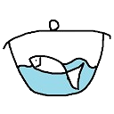
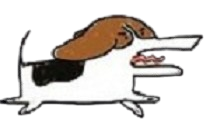

<!---------------------------search bar without css--------------------------------------->

<!-- 

    <i class="material-icons search-icon search-start">search</i>
    <input type="text" class="search-input" placeholder="Searching..." />
    <i class="material-icons search-icon search-clear">clear</i>
    

 --> 

<!----------------------------search bar with css-------------------------------------->



<!-----------------------------------LOGO-------------------------------------->

    

<!-----------------------------图片跳转搜索页面------------------------------------->

<!-- 

    

 -->

<!-- style = 'fixed' -->